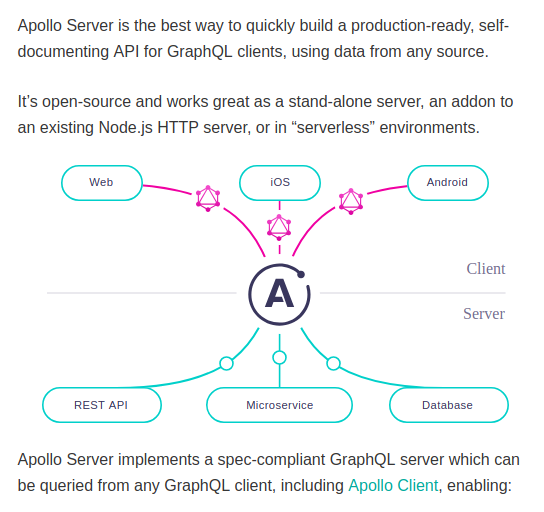
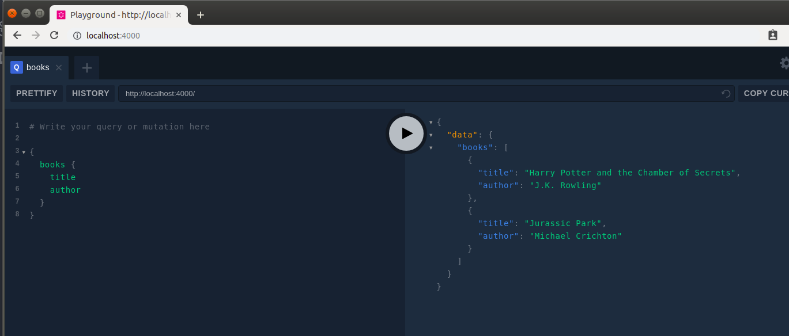
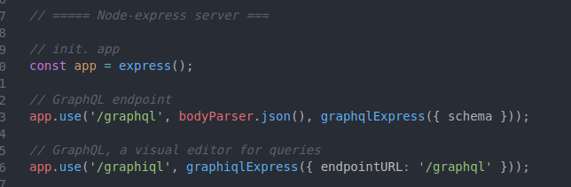
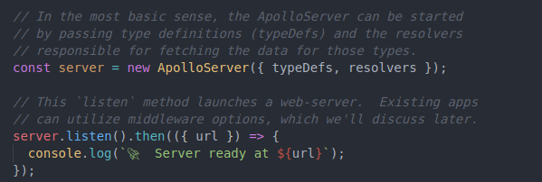

**Getting started**

https://www.apollographql.com/docs/apollo-server/v2/getting-started.html

Apollo server 2

deps:

apollo-server: The Apollo server library which allows you to focus on defining the shape of your data and how to fetch it.

graphql: The library used to build a schema and to execute queries on that schema

`npm install --save apollo-server graphql`

queries:

curl:
curl 'http://localhost:4000/' -H 'Accept-Encoding: gzip, deflate, br' -H 'Content-Type: application/json' -H 'Accept: application/json' -H 'Connection: keep-alive' -H 'DNT: 1' -H 'Origin: http://localhost:4000' --data-binary '{"query":"# Write your query or mutation here\n\n{\n  books {\n    title\n    author\n  }\n}"}' --compressed

##### apollo server 1 vs server 2 setup

1. server, routes setup in apollo 2 is more automatic

in 1, we have to setup routes manually 

in 2, we just need `new ApolloServer({ typeDefs, resolvers });`

2. in 2, we append typedefs with `gql'' `

