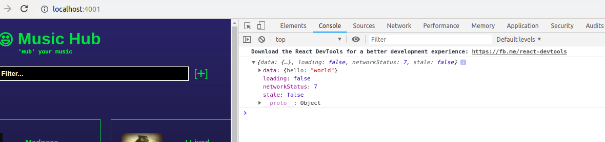

https://www.apollographql.com/docs/react/essentials/get-started.html

setup

`npm install apollo-boost react-apollo graphql --save`


query
`client.query({
    query: gql`
        {
            ...
        }
    `
})`


**SIDENOTE**

- add `.mjs` to webpack extensions when using GraphQL exports
on client side

```
  resolve: {
    extensions: ['.mjs', '.js', '.jsx'],
  },
```

-> `graphql_test.js`



