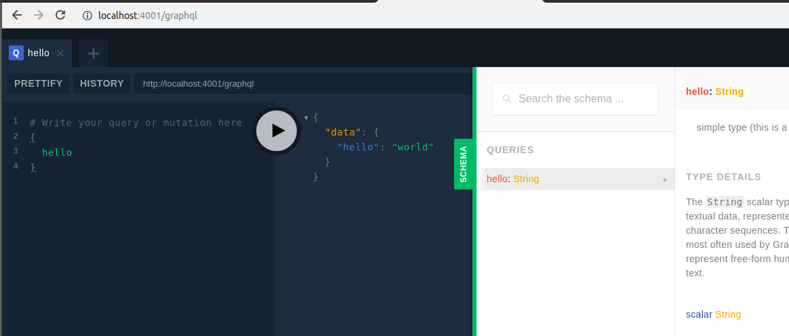
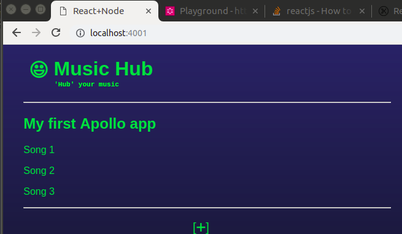
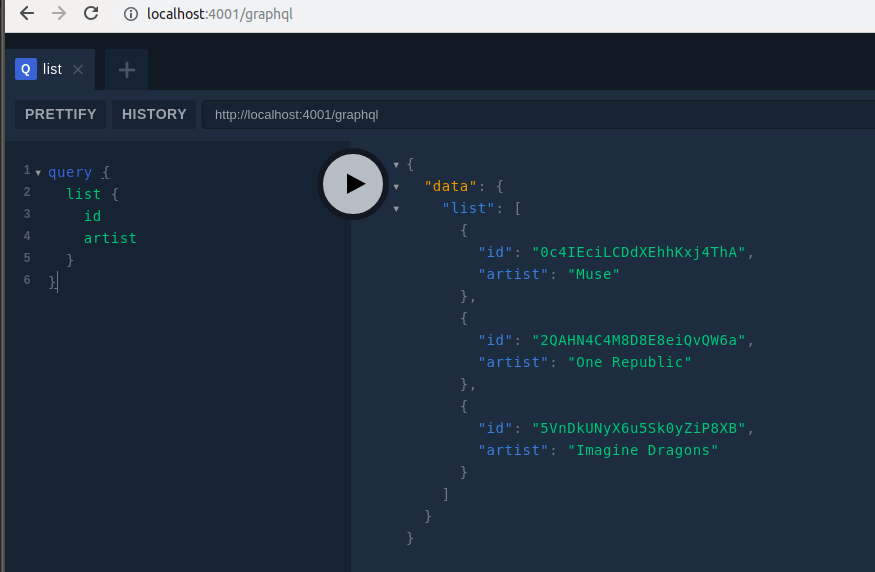

integrating GraphQL with an existing React, Node app

`npm install --save apollo-server graphql`

HTTP server support package for Express
`npm install --save apollo-server-express`


Apollo Server will set an Express server up for you as long as you provide it with 
  - typeDefs:string representing your GraphQL schema, and 
  - resolvers:  map of functions that implement your schema


## `schema.js`
- contains typeDefs and resolvers


## create ApolloServer and attach to express app

```
const { ApolloServer, gql } = require('apollo-server-express');
const { typeDefs, resolvers } = require('./schema');

const apolloServer = new ApolloServer({
    typeDefs,
    resolvers,
});

apolloServer.applyMiddleware({ app });

// same
// apolloServer.applyMiddleware({ app, path: '/graphql' });
```




### Client

Put `ApolloProvider` somewhere high in app, to access GraphQL data




Object Type

